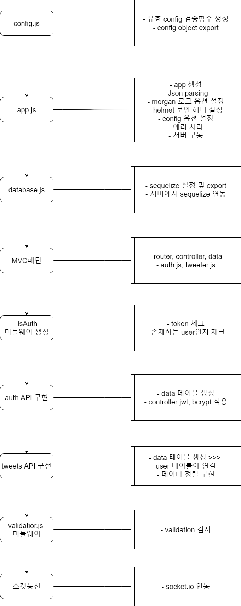

# 트위터 API 클론코딩

온라인 강의(드림코딩-노드로 배우는 백엔드 A-Z)에서 진행한 트위터 API 클론 프로젝트

 

## ✅ 페이지 도메인

https://twittercl.netlify.app/

 

## ✅ API 스펙

- [Tweets API 스펙](./설계/tweets.api.md)

- [Auth API 스펙](./설계/auth.api.md)

 

## ✅ 설계과정

 

## ✅ 배포

- netlify
  - 프론트엔드 프로젝트 배포
- heroku
  - 백엔드 프로젝트 배포
  - postgerSQL
  - https://twittercs.herokuapp.com/
